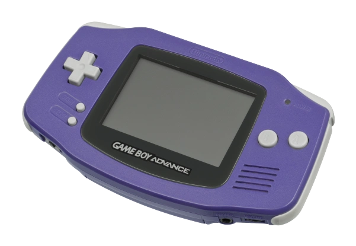

# gba-docs-ja

GameBoyAdvanceについて、技術的な詳細を日本語でまとめたものです。

突然消えたり非公開にする可能性もあるので心配な方はクローンしておくことをお勧めします。

> [!WARNING]
> このレポジトリは大半が執筆途中です。なので現在、ドキュメントとしての信頼性は皆無です。  
> また、コミット履歴は気まぐれで破壊されることがあります。

## コンテンツ一覧

### GBA

- [仕様](spec.md)
- [メモリマップ](memory.md)
- [IOレジスタ](io.md)
- [DMA転送](dma.md)
- [割り込み](interrupt.md)
- [システム制御](system.md)
  - [WAITCNT](system.md)
  - [POSTFLG](system.md)
  - [HALTCNT](system.md)
  - [MEMCNT](system.md)
- [タイマー(TMnCNT)](timer.md)
- [サウンド](sound.md)
- [キー入力](keypad.md)
- [特殊な挙動](unpredictable.md)

### カートリッジ

- [カートリッジヘッダ](cartridge/header.md)
- [カートリッジROM](cartridge/rom.md)
- [バックアップメディア](cartridge/backup/README.md)
  - [SRAM/FRAM](cartridge/backup/sram.md)
  - [EEPROM](cartridge/backup/eeprom.md)
  - [FLASH](cartridge/backup/flash.md)
  - [DACS](cartridge/backup/README.md)
- [カートリッジのプリフェッチ](cartridge/prefetch.md)
- 周辺機器・その他
  - [GPIO](cartridge/addon/gpio.md)
  - [RTC(時計機能)](cartridge/addon/rtc.md)
  - [太陽センサー](cartridge/addon/solar.md)
  - [振動パック](cartridge/addon/rumble.md)
  - [カードeリーダー](cartridge/addon/carde.md)
  - [ファミコンミニシリーズ](cartridge/addon/classic.md)

### CPU

- [レジスタ](arm7tdmi/register.md)
- [ARM命令一覧](arm7tdmi/instruction.md)
  - [ALU](arm7tdmi/arm/alu.md)
  - [分岐命令](arm7tdmi/arm/branch.md)
  - [乗算](arm7tdmi/arm/multiply.md)
  - [ロード/ストア](arm7tdmi/arm/loadstore.md)
  - [ロード/ストア その2](arm7tdmi/arm/loadstore2.md)
  - [ロード/ストア その3](arm7tdmi/arm/loadstore3.md)
  - [プロセッサ状態](arm7tdmi/arm/psr.md)
  - [スワップ命令](arm7tdmi/arm/swap.md)
  - [コプロセッサ命令](arm7tdmi/arm/coprocessor.md)
- [THUMB命令一覧](arm7tdmi/thumb/instruction.md)
  - [レジスタ操作](arm7tdmi/thumb/register.md)
  - [ロード/ストア](arm7tdmi/thumb/loadstore.md)
  - [ロード/ストア(スタック)](arm7tdmi/thumb/loadstore2.md)
  - [アドレッシング](arm7tdmi/thumb/addressing.md)
  - [分岐命令](arm7tdmi/thumb/branch.md)
- [サイクル](arm7tdmi/cycle.md)
  - [Waitstate](arm7tdmi/cycle.md)
- [条件](arm7tdmi/cond.md)
- [例外](arm7tdmi/exception.md)
- [アラインメント](arm7tdmi/alignment.md)

### グラフィック

- [LCD制御レジスタ](video/control.md)
  - [DISPCNT](video/control.md)
  - [GREENSWP](video/control.md)
- 背景(BG)
  - [制御レジスタ(BGnCNT)](video/bg/control.md)
  - [BGモード](video/bg/mode/)
    - [タイルモード(Mode0-2)](video/bg/mode/tile/README.md)
      - [タイルデータ](video/bg/mode/tile/tiledata.md)
      - [BGマップ](video/bg/mode/tile/bgmap.md)
    - [ビットマップモード(Mode3-5)](video/bg/mode/bitmap.md)
  - [スクロール(BGnOFS)](video/bg/scroll.md)
  - [伸縮回転](video/bg/scalerot.md)
    - [BGnX](video/bg/scalerot.md)
    - [BGnPA](video/bg/scalerot.md)
- [ウィンドウ](video/window.md)
- [モザイク](video/mosaic.md)
- [ブレンド](video/blend.md)
- [割り込み](video/interrupt.md)
  - [DISPSTAT](video/interrupt.md)
  - [VCOUNT](video/interrupt.md)
- [スプライト](video/sprite.md)
- [OAM](video/oam.md)
- [パレット](video/palette.md)
- [描画サイクル](video/scanline.md)

### BIOS

- [命令一覧](bios/bios.md)
- [算術](bios/arithmetic.md)
- [伸縮回転](bios/rotation_scaling.md)
- [メモリコピー](bios/memcpy.md)
- [Halt](bios/halt.md)
- [リセット](bios/reset.md)
- [解凍](bios/decompression.md)

### 通信機能

- [シリアル通信](communication/sio/README.md)
  - [通常モード](communication/sio/normal.md)
  - [マルチプレイモード](communication/sio/multiplayer.md)
  - [UARTモード](communication/sio/uart.md)
  - [JOYバスモード](communication/sio/joybus.md)
  - [汎用モード](communication/sio/general.md)
- [ワイヤレスアダプタ](communication/wireless.md)
- [赤外線通信](communication/infrared.md)

### その他

この辺は、自分のメモ書きの側面も強いです。

- [devkitProのインストール](others/homebrew/devkit.md)
- [HQミキサー](others/homebrew/hq_mixer.md)
- [mGBAをgdbでデバッグする方法](others/homebrew/mgba_with_gdb.md)
- [GBA命令のデコード](others/emudev/decode.md)
- [GBAのサイクルカウントとプリフェッチについて](others/emudev/cycle-counting-prefetch.md)
- [Ghidraを用いたGBAROMのデバッグ](others/ret/ghidra-debugger.md)

## 関連するレポジトリ

- [gb-docs-ja](https://github.com/akatsuki105/gb-docs-ja): GameBoyについて
- [nds-docs-ja](https://github.com/akatsuki105/nds-docs-ja): Nintendo DSについて
- [snes-docs-ja](https://github.com/akatsuki105/snes-docs-ja): スーパーファミコンについて

## 参考記事

- [GBATEK](https://web.archive.org/web/20210108175702/https://problemkaputt.de/gbatek.htm)
- [GBA develop Wiki](http://akkera102.sakura.ne.jp/gbadev/)
- [情報システム設計演習－携帯型ゲームプログラミング－](http://jaco.ec.t.kanazawa-u.ac.jp/edu/GBA/)
- [ultimate-tutorial-2](https://tutorial.feuniverse.us/)
- [ARM7TDMI](https://ngmansion.github.io/hokanko/ARM7TDMI/)
- [ARM のスタックについて](http://masahir0y.blogspot.com/2012/11/arm.html)
- [Assembler for the GBA](https://github.com/Touched/asm-tutorial/blob/master/doc.md)
- [Tonc v1.4.2](https://www.coranac.com/tonc/text/toc.htm)
- [hkpr.info](https://hkpr.info/ds/wiki/index.php)
- [mGBA](https://mgba.io/)
- [NanoBoyAdvance](https://github.com/fleroviux/NanoBoyAdvance)
- [VisualBoyAdvance-m](https://github.com/visualboyadvance-m/visualboyadvance-m)
- [loveemu labo](https://loveemu.hatenablog.com/)
