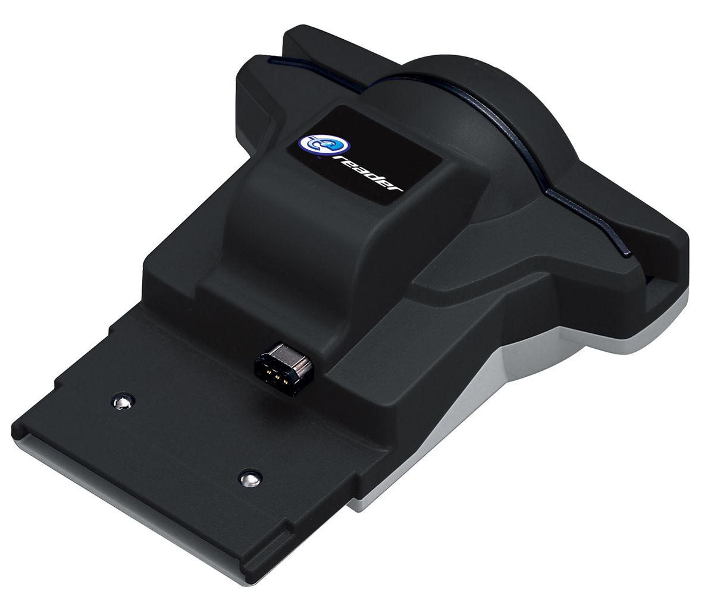

# カードe

## 概要

カードeは、大きなGBAカートリッジに、ドットコードを読み取るハードウェアを内蔵したものです。海外ではe-Readerと呼ばれています。

ドットコードとは、厚紙のカードの端に印刷された白黒のピクセルの小さな帯のことです。このカードをe-Readerのスロットに通すことで、まるで磁気カードリーダーのような感覚で読み取ることができるのです。

ドットコード上のバイナリデータには、GBAのネイティブコード（ARM/THUMB）、またはソフトウェアでエミュレートされた8ビットのZ80やファミコン（6502）のコードで、小さなゲームが格納されています。

**ハードウェア(カードe)のスペック**

ハードウェアは、通常の8MBのROMと128KBのFLASHチップ、2つの通信ポート、カスタムPGAチップ(PGA=Pin Grid Array)、カメラモジュール（光源として使用される2つの赤色LED付き）、LED電圧を生成するためのいくつかのアナログ部品などで構成されています。

カメラは402x302ピクセル、7ビットのモノクロ色深度に対応していますが、PGAは1ビットの色深度でスキャンラインあたり最大320ピクセルにクリップします。

**通信ポート**

カードeの2つの通信ポートは、単に相互に接続されているだけで、他のカードeとは接続されていません。このポートは初代GBAでのみ使用されています。見た目はカードeの大型カートリッジがGBAの通信ポートを覆う形になります。

ニンテンドーDS（またはGBA-Micro）にカードeを挿入しようとすると、カードeのリンクプラグがDSのケースに当たってしまうため、ハードウェアを少し改造しないと動作しませんでした。GBASPやDS Liteではそのような問題はありません。

**リビジョン/バージョン**

カードeには3つの種類があります。

- カードe(日本)
- カードeプラス(日本)
- e-Reader(日本以外)

の3つです。

カードeは64KBのフラッシュのみで、通信ポートはなく、Z80コードのみをサポートし、NES/GBAコードはサポートしないと言われています。

カードeプラスとe-Readerは、違う種類のカードeのカードを拒否することと、日本ではタイトル文字列がASCIIではないことを除けば、ほとんど同じであるはずです。

**エミュレーション**

任天堂のプログラマーは、パックマンのようなゲームを4MB以下に収めることはできませんでした。そのため、これらのゲームを動かすために彼らが取った解決策はメモリを増やすことでした。

つまり、カードe本体には8MBのBIOS ROMを搭載し、その中にはユーザーインターフェースと、20年前の8bit NESやGame&Watchのタイトルを動かすためのソフトウェアのエミュレーションが含まれており、数枚のドットコードに収まるようになっています。

## I/Oポート

TODO

## ドットコードフォーマット

TODO

## データフォーマット

TODO

## プログラムコード

TODO

## API

TODO

## VPK解凍

TODO

## エラー訂正

TODO

## ファイルフォーマット

**.BMP Files (homebrew 300 DPI strips)**

アドレスバーやシンクマーク（「ドットコード」の章を参照）を含むドットコードストリップ全体の画像を、マイクロソフト社のビットマップ形式で収録しています。

Contains a picture of the whole dotcode strip with address bars and sync marks (see Dotcode chapter) in Microsoft's Bitmap format. The image is conventionally surrounded by a blank 2-pixel border, resulting in a size of 989x44 pixels for long strips. The file should should have 1bit color depth. The pixels per meter entry should match the desired printing resolution, either 300 DPI or 360 DPI. But, resolution of printer hardware is typically specified in inch rather than in meters, so an exact match isn't supported by Microsoft. Most homebrew .BMP files contain nonsense resolutions like 200 DPI, or 300 dots per meter (ca. 8 DPI).

**.JPG Files (scanned 1200 DPI strips)**

Same as BMP, but should contain a dotcode scanned at 1200 DPI, with correct orientation (the card-edge side at the bottom of the image), and containing only the dotcode (not the whole card), so the JPG size should be about 3450x155 pixels for long strips.
No$gba currently doesn't work with progressive JPGs. Scans with white background can be saved as monochrome JPG. Scans with red/yellow background should contain a correct RED layer (due to the red LED light source) (the brightness of the green/blue layers can be set to zero for better compression).

**.RAW Files**

TODO

