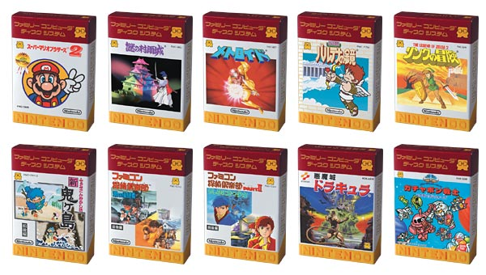

# ファミコンミニシリーズ

GBAのソフトには、ファミコンのゲームをGBA用に移植/エミュレートした[ファミコンミニシリーズ](https://www.nintendo.co.jp/n08/fmk/index.html)というシリーズのゲームがあります。

これらのゲームはオリジナルのGBA本体やカートリッジを使用していない場合は、次のような、互換性の問題を引き起こす可能性のある、一般的ではないことをしているゲームです。

- CPU pipeline (selfmodifying code that shall NOT affect prefetched opcodes)
- STMDA write to I/O ports (writes in INCREASING order, not DECREASING order)
- SRAM検知 (オリジナルのゲームではEEPROMを使っており、SRAMが使われていた場合拒絶(?)します)
- ROMのミラー (instead of the usual increasing numbers in unused ROM area)
- RAMのミラー (例: EWRAM`0x0200_0000`にアクセスする代わりに`0x02F0_0000`にアクセス)

ファミコンミニシリーズかどうかは`0x0800_00AC`の値がASCIIコードの`F`(`0x66`)かをチェックすることで判別できます。
