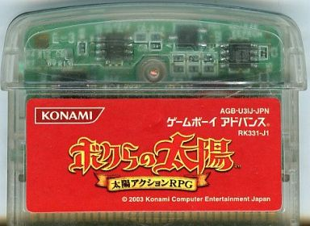

# 太陽センサー

文字通り、太陽の光を検知するためのセンサーです。[ボクらの太陽(ボクタイ)](https://ja.wikipedia.org/wiki/%E3%83%9C%E3%82%AF%E3%82%89%E3%81%AE%E5%A4%AA%E9%99%BD)では、カートリッジに太陽光が当たると吸血鬼を倒すことができます。

太陽センサーとしてフォトダイオードを使用しています。

カートリッジは透明なケースに入っていて、通常のカートよりも少し長いので、センサーはカートリッジスロットから出ています。



説明書によると、このセンサーは太陽光でのみ動作するとのことですが、実際にはどんな強い光源でも動作します。例えば、100ワットの電球を1〜2cmの距離に置いた場合でも動作します。

センサーへのアクセスは、ROMチップに内蔵された4bitのI/Oポート（3bitのみ使用）を介して行われます。詳細は[GPIO](gpio.md)を参照してください。

## A/D変換

```
Note: 筆者(pokemium)が電子回路に詳しくないため、間違った記述があるかもしれません。
```

このカートリッジは、独自の[Digital Ramp ADC](https://www.allaboutcircuits.com/textbook/digital/chpt-13/digital-ramp-adc/)を使用しています。

これは、コンデンサの充電時間を測定するよりも優れており、本物のADCチップよりも安価です。

74LV4040の12bitのバイナリカウンタが内蔵されており、I/Oポートを介してCPUからクロックが送られてきます。

このうち下位8bitのみが使用され、抵抗ラダー型のDACに渡され、直線的に増加する電圧が生成されます。

この電圧はTLV272の電圧コンパレータに渡され、カウンタの電圧がセンサの電圧よりも大きくなるとI/Oポートに信号が送られます。

## サンプルコード

```asm
  strh  0001h,[80000c8h] ;-enable R/W mode
  strh  0007h,[80000c6h] ;-init I/O direction
  strh  0002h,[80000c4h] ;-reset counter to zero (high=reset) (I/O bit0)
  strh  0000h,[80000c4h] ;-clear reset (low=normal)
  mov   r0,0             ;-initial level
 @@lop:
  strh  0001h,[80000c4h] ;-clock high ;\increase counter      (I/O bit1)
  strh  0000h,[80000c4h] ;-clock low  ;/
  ldrh  r1,[80000c4h]    ;-read port                          (I/O bit3)
  tst   r1,08h           ;\
  addeq r0,1             ; loop until voltage match (exit with r0=00h..FFh),
  tsteq r0,100h          ; or until failure/timeout (exit with r0=100h)
  beq   @@lop            ;/
```

使用するクロックレートによって結果が異なります。

上記のサンプルコードを使う場合、IRQやDMAによって処理を中断されないようにするか、超低速のクロックレート（例：ボクタイでは666Hz）を使用して、小さなIRQ/DMAの遅れが全体のタイミングにほとんど影響しないようにする必要があります。

上記のサンプルコードを実行すれば、太陽センサーから読み取った値が次のように得られます。

値 | 内容
-- | -- 
0xE8 | 完全に真っ暗(LED光や、雨の日の日光レベル)
0xDx | 100W電球で灯した部屋くらいの明るさの日光
0x5x | ボクタイで太陽ゲージがMAXになるくらいの日光
0x00 | 原爆の光レベルの日光

正確な値はカートリッジごとに変わる可能性があるため、自作のカートリッジに太陽センサーを導入したい場合は、暗さの補正機能を搭載して、遊んでもらう際にはユーザーがセンサーをしばらく覆うように促すことをお勧めします。

ボクタイの場合は、タイトル画面で左/右を押して入れるオプションメニューでこの補正を行います。

また、自動補正を使えば、理論的には、これまでにゲーム内で見た最も暗いレベルを記憶することができます。

