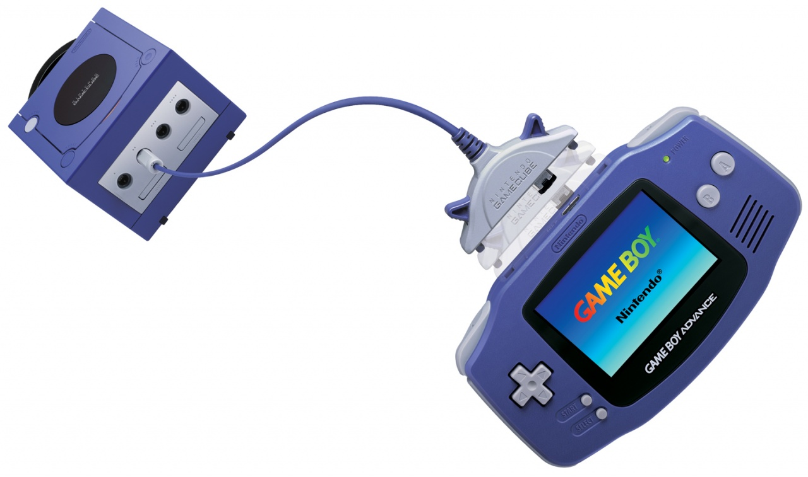

# [JOYバスモード](https://mgba-emu.github.io/gbatek/#siojoybusmode)



この通信モードは、任天堂の標準化されたプロトコルであるJOYバスプロトコルを使った通信モードです。

JOYバスプロトコルについての詳細は[こちら](https://n64brew.dev/wiki/Joybus_Protocol)を参照してください。

この通信モードでは、GBAは常にスレーブとして動作します。

In this mode, SI and SO pins are data lines (apparently synchronized by Start/Stop bits?).

SC and SD are set to low (including during active transfer?)

The transfer rate is unknown?

## レジスタ

### 4000134h - RCNT (R) - モード選択レジスタ

SIOCNTのbit13-12と合わせて、転送モードを設定するのに利用します。

使われているのはbit14-15だけです。

ビット | 内容
---- | ---- 
0-3  | 未定義 (current SC,SD,SI,SO state, as for General Purpose mode)
4-8  | 不使用 (常に0が望ましいが1を書き込むこともできる)
9-13 | 不使用 (常に0,読み取り専用)
14   | 1
15   | 1

### 4000128h - SIOCNT - SIO制御レジスタ

JOYバスモードではこのレジスタは使われません。

### 4000140h - JOYCNT - JOYバス制御レジスタ (R/W)

ビット | 内容
---- | ---- 
0    | Device Reset Flag     (Command FFh)          (Read/Acknowledge)
1    | Receive Complete Flag (Command 14h or 15h?)  (Read/Acknowledge)
2    | Send Complete Flag    (Command 15h or 14h?)  (Read/Acknowledge)
3-5  | 不使用
6    | IRQ when receiving a Device Reset Command  (0=Disable, 1=Enable)
7-31 | 不使用

Bit 0-2 are working much like the bits in the IF register: Write a "1" bit to reset (acknowledge) the respective bit.

### 4000150h - JOY_RECV_L - Receive Data Register low (R/W)
### 4000152h - JOY_RECV_H - Receive Data Register high (R/W)

受信したデータがここに入ります。

### 4000154h - JOY_TRANS_L - Send Data Register low (R/W)
### 4000156h - JOY_TRANS_H - Send Data Register high (R/W)

送信するデータをここに格納します。

### 4000158h - JOYSTAT - Receive Status Register (R/W)

ビット | 内容
---- | ---- 
0    | 不使用
1    | 受信ステータスフラグ   (0=Remote GBA is/was receiving) (Read Only?)
2    | 不使用
3    | 送信ステータスフラグ      (1=Remote GBA is/was sending)   (Read Only?)
4-5  | General Purpose Flag  (Not assigned, may be used for whatever purpose)
6-31 | 不使用

JOY_TRANSに書き込みを行うとbit1は自動的にセットされます。

JOY_RECVから読み取りを行うとbit3は自動的にクリアされます。

## コマンド

以下は、GBAが受け取ることのできる4つのコマンドです。

なお、GBA（スレーブ）は自らコマンドを送信することはできず、できるのは受信データを読み取ることと、マスターユニットが読み取ることができる（またはできない）「返信」データを返すことだけです。

### Command FFh - Device Reset

```
  Receive FFh (Command)
  Send    00h (GBA Type number LSB (or MSB?))
  Send    04h (GBA Type number MSB (or LSB?))
  Send    XXh (lower 8bits of SIOSTAT register)
```

### Command 00h - Type/Status Data Request

```
  Receive 00h (Command)
  Send    00h (GBA Type number LSB (or MSB?))
  Send    04h (GBA Type number MSB (or LSB?))
  Send    XXh (lower 8bits of SIOSTAT register)
```

### Command 15h - GBA Data Write (to GBA)

```
  Receive 15h (Command)
  Receive XXh (Lower 8bits of JOY_RECV_L)
  Receive XXh (Upper 8bits of JOY_RECV_L)
  Receive XXh (Lower 8bits of JOY_RECV_H)
  Receive XXh (Upper 8bits of JOY_RECV_H)
  Send    XXh (lower 8bits of SIOSTAT register)
```

### Command 14h - GBA Data Read (from GBA)

```
  Receive 14h (Command)
  Send    XXh (Lower 8bits of JOY_TRANS_L)
  Send    XXh (Upper 8bits of JOY_TRANS_L)
  Send    XXh (Lower 8bits of JOY_TRANS_H)
  Send    XXh (Upper 8bits of JOY_TRANS_H)
  Send    XXh (lower 8bits of SIOSTAT register)
```

