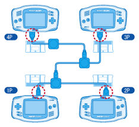

# [マルチプレイモード](https://mgba-emu.github.io/gbatek/#siomultiplayermode)

マルチプレイモードでは4ユニット間の通信が可能になっています。



## レジスタ

### 4000134h - RCNT (R) - モード選択レジスタ

`SIOCNT.12-13`と合わせて、転送モードを設定するのに利用します。

使われているのはbit15だけです。

ビット | 内容
---- | ---- 
0-3  | 未定義 (current SC,SD,SI,SO state, as for General Purpose mode)
4-8  | 不使用 (常に0が望ましいが1を書き込むこともできる)
9-13 | 不使用 (常に0,読み取り専用)
14   | 不使用 (常に0が望ましいが1を書き込むこともできる)
15   | 0 (モードをノーマル/マルチプレイ/UARTにしたい場合)

```
Note: 未定義の仕様ですが、任天堂製のゲームではbit0をマルチプレイモードでSCの現在の状態を表すのに使っているようです。
```

### 4000128h - SIOCNT - SIO制御レジスタ (R/W)

ビット | 内容
---- | ---- 
0-1  | ボーレート (0-3: 9600,38400,57600,115200 bps)
2    | SI-Terminal   (0=Parent, 1=Child)                  (Read Only)
3    | SD-Terminal   (0=Bad connection, 1=All GBAs Ready) (Read Only)
4-5  | マルチプレイID (0=マスター, 1-3=1~3番目のスレーブ) (Read Only)
6    | エラーフラグ  (0=正常, 1=エラー) (Read Only)
7    | Start/Busy Bit      (0=Inactive, 1=Start/Busy) (スレーブ側のみ Read Only)
8-11 | 不使用 (読み書き可能、0にしたままにすることを推奨)
12   | 0  (マルチプレイモードにするため必須)
13   | 1  (マルチプレイモードにするため必須)
14   | IRQ有効化フラグ (0=無効, 1=完了時に転送リクエスト)
15   | 不使用 (読み取り専用で常に0)

最初の転送が完了するまで、マルチプレイIDビットの値は未定義です。

### 400012Ah - SIOMLT_SEND - Data Send Register (R/W)

他のGBAに送信したい16bitの送信データを入れます。

### 4000120h - SIOMULTI0 - SIO Multi-Player Data 0 (Parent) (R/W)
### 4000122h - SIOMULTI1 - SIO Multi-Player Data 1 (1st child) (R/W)
### 4000124h - SIOMULTI2 - SIO Multi-Player Data 2 (2nd child) (R/W)
### 4000126h - SIOMULTI3 - SIO Multi-Player Data 3 (3rd child) (R/W)

これらのレジスタは、転送開始時に自動的に`0xFFFF`にリセットされます。

転送後、これらのレジスタには、すべてのリモートGBAからの16bitの受信データ(接続されていないGBAがあった場合は0xFFFF)と、ローカルの送信データである`SIOMLT_SEND`データが含まれます。つまり、転送後、接続されているすべてのGBAの`SIOMULTI0-3`レジスタには同じ値が入ります。

例:

GBA | マルチプレイID | SIOMLT_SEND | SIOMULTI0 | SIOMULTI1 | SIOMULTI2 | SIOMULTI3
-- | -- | -- | -- | -- | -- | --
1台目 | 3  | 0xff45 | 0xff10 | 0xffa2 | 0xffd5 | 0xff45
2台目 | 1  | 0xffa2 | 0xff10 | 0xffa2 | 0xffd5 | 0xff45
3台目 | 0  | 0xff10 | 0xff10 | 0xffa2 | 0xffd5 | 0xff45
4台目 | 2  | 0xffd5 | 0xff10 | 0xffa2 | 0xffd5 | 0xff45

## 初期化処理

1. RCNTのbit14-15とSIOCNTのbit12-13を設定してマルチプレイモードにする
2. SIOCNTのbit3を見て全部のGBAがマルチプレイモードになっていることを確認する
3. SIOCNTのbit2を見てどのGBAがマスターになっているかを確認する

## 推奨される転送手順

1. 転送したいデータを`SIODATA_SEND`に書き込む
2. マスター側がスタートビットをセットする
3. 全ユニットは転送完了後、`SIOMULTI0-3`で受信したデータを処理する
4. 最初の転送が成功した後、`SIOCNT`のマルチプレイIDビットが有効となる
5. 送りたいデータがまだ存在する場合はこの手順を1から繰り返す

マスターユニットは、スレーブユニットがすでに古いデータを処理しているか、新しいデータを供給しているかに関係なくデータを送信します。そのため、マスターユニットは各転送の間に遅延処理を行なったり、エラーチェックを行う必要があるかもしれません。

また、スレーブユニットは一時的に他の通信モードに移行することで、マスターユニットに準備不足を知らせることができます（マルチプレイモードのように非アクティブ時にSDに1をセットすることはありません）。

## 転送プロトコル

スレーブN = マルチプレイIDがNのスレーブユニット

```
転送前
  - マスター側のSIを常に0になるようにする
  - 全GBAがマルチプレイモードでSDが1であることを確認する
  - マスター側が転送を開始すると、SC=LOW となり、スレーブ側のBusyビットがセットされる
Step A
  - マスターユニットのIDビットが0にセットされる
  - マスターユニットはStartビット(0)、16bitデータ、Stopビット(1)をSDを通して送信する
  - このデータは、すべてのGBAの SIOMULTI0 に書き込まれる(マスター含む)
  - マスターは、SOからスレーブ1のSIにSO(0)を転送する
  - 次のスレーブが一定時間経過してもデータを出力しない場合、転送を終了する。
Step B
  - スレーブ1のIDビットが1にセットされる
  - スレーブ1はStartビット(0)、16bitデータ、Stopビット(1)をSDを通して送信する
  - このデータは、すべてのGBAの SIOMULTI1 に書き込まれる(スレーブ1含む)
  - スレーブ1は、SOからスレーブ2のSIにSO(0)を転送する
  - 次のスレーブが一定時間経過してもデータを出力しない場合、転送を終了する。
Step C
  - スレーブ2のIDビットが2にセットされる
  - スレーブ2はStartビット(0)、16bitデータ、Stopビット(1)をSDを通して送信する
  - このデータは、すべてのGBAの SIOMULTI2 に書き込まれる(スレーブ2含む)
  - スレーブ2は、SOからスレーブ3のSIにSO(0)を転送する
  - 次のスレーブが一定時間経過してもデータを出力しない場合、転送を終了する。
Step D
  - スレーブ3のIDビットが3にセットされる
  - スレーブ3はStartビット(0)、16bitデータ、Stopビット(1)をSDを通して送信する
  - このデータは、すべてのGBAの SIOMULTI3 に書き込まれる(スレーブ2含む)
  - 転送終了
転送終了後
  - マスターはSCを1にセット、全ユニットはSOを1にセット
  - 全てのGBAのStart/Busyビットは自動的にクリアされる
  - 全てのGBAで割り込みが要求される(IRQビットが有効な場合)
```

## エラーフラグ

`SC=LOW`で転送を通知しても、スレーブが`SI=LOW`を受信しなかった場合に、このビットがセットされます。(4台以上のGBAを接続した場合や、前のスレーブ側が接続されていない場合に発生することがあります。)また、StopbitがHIGHでなかった場合にもこのビットはセットされます。

転送がアクティブなときはエラービットが不定になる場合があるので、エラービットからの読み取りは転送完了後にすべきです。プログラマがこのビットに対して書き込むことはできません。一部または全部のGBAでエラーが発生した場合でも、通常通り転送を継続し、完了します。

ビットは転送ごとに自動的にリセット/初期化されるのか、それとも手動でリセットする必要があるのかは不明です。

## 転送時間

転送時間は、選択されたボーレートによって異なります。

また、接続されたGBAの数に依存します。GBAの数が増えると、転送するBit量（各GBAの16bitデータとスタート/ストップビット）、各GBAのデータ間の遅延、および最終タイムアウト（4GBA未満の場合）が変化するからです。

GBAの数 | 転送Bit量 | 遅延 | 最終タイムアウト
-- | -- | -- | --
1 | 18 | None | Yes
2 | 36 | 1    | Yes
3 | 54 | 2    | Yes
4 | 72 | 3    | None

上記は、各転送の開始と処理に費やされなければならない追加のCPU時間をカウントしていません。

## 高速な単方向転送

マルチプレイケーブルは、マルチプレイモード以外に、マスターユニットからすべてのスレーブユニットへの高速な一方通行のデータ転送を行うノーマルモードでも使用できます。

詳細は[ノーマルモード](normal.md)をみてください。
