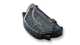
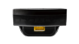

# [ワイヤレスアダプタ](https://mgba-emu.github.io/gbatek/#gbawirelessadapter)





## ワイヤレスアダプタに対応したゲーム

```
  bit Generations series (Japan only)
  Boktai 2: Solar Boy Django (Konami)
  Boktai 3: Sabata's Counterattack
  Classic NES Series: Donkey Kong
  Classic NES Series: Dr. Mario
  Classic NES Series: Ice Climber
  Classic NES Series: Pac-Man
  Classic NES Series: Super Mario Bros.
  Classic NES Series: Xevious
  Digimon Racing (Bandai) (No Wireless Adapter support in European release)
  Dragon Ball Z: Buu's Fury (Atari)
  Famicom Mini Series: #13 Balloon Fight
  Famicom Mini Series: #12 Clu Clu Land
  Famicom Mini Series: #16 Dig Dug
  Famicom Mini Series: #02 Donkey Kong
  Famicom Mini Series: #15 Dr. Mario
  Famicom Mini Series: #03 Ice Climber
  Famicom Mini Series: #18 Makaimura
  Famicom Mini Series: #08 Mappy
  Famicom Mini Series: #11 Mario Bros.
  Famicom Mini Series: #06 Pac-Man
  Famicom Mini Series: #30 SD Gundam World Scramble Wars
  Famicom Mini Series: #01 Super Mario Bros.
  Famicom Mini Series: #21 Super Mario Bros.
  Famicom Mini Series: #19 Twin Bee
  Famicom Mini Series: #14 Wrecking Crew
  Famicom Mini Series: #07 Xevious
  Hamtaro: Ham-Ham Games (Nintendo)
  Lord of the Rings: The Third Age, The (EA Games)
  Mario Golf: Advance Tour (Nintendo)
  Mario Tennis: Power Tour (Nintendo)
  Mega Man Battle Network 5: Team Protoman (Capcom)
  Mega Man Battle Network 5: Team Colonel (Capcom)
  Mega Man Battle Network 6: Cybeast Falzar
  Mega Man Battle Network 6: Cybeast Gregar
  Momotaro Dentetsu G: Make a Gold Deck! (Japan only)
  Pokemon Emerald (Nintendo)
  Pokemon FireRed (Nintendo)
  Pokemon LeafGreen (Nintendo)
  Sennen Kazoku (Japan only)
  Shrek SuperSlam
  Sonic Advance 3
```

## ワイヤレスアダプタのログイン

### GBA Wireless Adapter Login


```
  rcnt=8000h    ;\
  rcnt=80A0h    ;
  rcnt=80A2h    ; reset adapter or so
  wait          ;
  rcnt=80A0h    ;/
  siocnt=5003h  ;\set 32bit normal mode, 2MHz internal clock
  rcnt=0000h    ;/
  passes=0, index=0
 @@lop:
  passes=passes+1, if passes>32 then ERROR  ;give up (usually only 10 passses)
  recv.lo=siodata AND FFFFh    ;response from adapter
  recv.hi=siodata/10000h       ;adapter's own "NI" data
  if send.hi<>recv.lo then index=0, goto @@stuck  ;<-- fallback to index=0
  if (send.lo XOR FFFFh)<>recv.lo then goto @@stuck
  if (send.hi XOR FFFFh)<>recv.hi then goto @@stuck
  index=index+1
 @@stuck:
  send.lo=halfword[@@key_string+index*2]
  send.hi=recv.hi XOR FFFFh
  siodata=send.lo+(send.hi*10000h)
  siocnt.bit7=1                        ;<-- start transmission
  if index<4 then goto @@lop
  ret
 @@key_string db 'NINTENDO',01h,80h    ;10 bytes (5 halfwords; index=0..4)
```

### Data exchanged during Login

```
               GBA                         ADAPTER
               xxxx494E ;\     <-->        xxxxxxxx
               xxxx494E ; "NI" <--> "NI"/; 494EB6B1 ;\
  NOT("NI") /; B6B1494E ;/     <-->     \; 494EB6B1 ; NOT("NI")
            \; B6B1544E ;\"NT" <--> "NT"/; 544EB6B1 ;/
  NOT("NT") /; ABB1544E ;/     <-->     \; 544EABB1 ;\NOT("NT")
            \; ABB14E45 ;\"EN" <--> "EN"/; 4E45ABB1 ;/
  NOT("EN") /; B1BA4E45 ;/     <-->     \; 4E45B1BA ;\NOT("EN")
            \; B1BA4F44 ;\"DO" <--> "DO"/; 4F44B1BA ;/
  NOT("DO") /; B0BB4F44 ;/     <-->     \; 4F44B0BB ;\NOT("DO")
            \; B0BB8001 ;-fin  <-->  fin-; 8001B0BB ;/
                 \   \                      \   \
                  \   LSBs=Own               \   LSBs=Inverse of
                   \   Data.From.Gba          \   Prev.Data.From.Gba
                    \                          \
                     MSBs=Inverse of            MSBs=Own
                      Prev.Data.From.Adapter     Data.From.Adapter
```

## ワイヤレスアダプタのコマンドについて

### Wireless Command/Parameter Transmission


```
  GBA       Adapter
  9966ppcch 80000000h   ;-send command (cc), and num param_words (pp)
  <param01> 80000000h   ;\
  <param02> 80000000h   ; send "pp" parameter word(s), if any
  ...       ...         ;/
  80000000h 9966rraah   ;-recv ack (aa=cc+80h), and num response_words (rr)
  80000000? <reply01>   ;\
  80000000? <reply02>   ; recv "rr" response word(s), if any
  ...       ...         ;/
```

Wireless 32bit Transfers

```
  wait until [4000128h].Bit2=0  ;want SI=0
  set [4000128h].Bit3=1         ;set SO=1
  wait until [4000128h].Bit2=1  ;want SI=1
  set [4000128h].Bit3=0,Bit7=1  ;set SO=0 and start 32bit transfer
```

All command/param/reply transfers should be done at Internal Clock (except,
Response Words for command 25h,27h,35h,37h should use External Clock).


### Wireless Commands


```
  Cmd Para Reply Name
  10h -    -     Hello (send immediately after login)
  11h -    1     Good/Bad response to cmd 16h ?
  12h
  13h -    1
  14h
  15h
  16h 6    -     Introduce (send game/user name)
  17h 1    -     Config (send after Hello) (eg. param=003C0420h or 003C043Ch)
  18h
  19h
  1Ah
  1Bh
  1Ch -    -
  1Dh -    NN    Get Directory? (receive list of game/user names?)
  1Eh -    NN    Get Directory? (receive list of game/user names?)
  1Fh 1    -     Select Game for Download (send 16bit Game_ID)
```


```
  20h -    1
  21h -    1     Good/Bad response to cmd 1Fh ?
  22h
  23h
  24h -    -
  25h                                       ;use EXT clock!
  26h -    -
  27h -    -     Begin Download ?           ;use EXT clock!
  28h
  29h
  2Ah
  2Bh
  2Ch
  2Dh
  2Eh
  2Fh
```


```
  30h 1    -
  31h
  32h
  33h
  34h
  35h                                       ;use EXT clock!
  36h
  37h                                       ;use EXT clock!
  38h
  39h
  3Ah
  3Bh
  3Ch
  3Dh -    -     Bye (return to language select)
  3Eh
  3Fh
```

Special Response 996601EEh for error or so? (only at software side?)

## GBA Wireless Adapter Component Lists

Main Chipset

```
  U1 32pin Freescale MC13190 (2.4 GHz ISM band transceiver)
  U2 48pin Freescale CT3000 or CT3001 (depending on adapter version)
  X3  2pin 9.5MHz crystal
```

The MC13190 is a Short-Range, Low-Power 2.4 GHz ISM band transceiver.

The processor is Motorola's 32-bit M-Core RISC engine. (?) MCT3000 (?)

See also: 
- [http://www.eetimes.com/document.asp?doc\_id=1271943](http://www.eetimes.com/document.asp?doc_id=1271943)

Version with GERMAN Postal Code on sticker:

```
  Sticker on Case:
    "GAME BOY advance, WIRELESS ADAPTER"
    "Pat.Pend.Made in Philipines, CE0125(!)B"
    "MODEL NO./MODELE NO.AGB-015 D-63760 Grossosteim P/AGB-A-WA-EUR-2 E3"
  PCB: "19-C046-04, A-7" (top side) and "B-7" and Microchip ",\\" (bottom side)
  PCB: white stamp "3104, 94V-0, RU, TW-15"
  PCB: black stamp "22FDE"
  U1 32pin "Freescale 13190, 4WFQ" (MC13190) (2.4 GHz ISM band transceiver)
  U2 48pin "Freescale CT3001, XAC0445"  (bottom side)
  X3  2pin "D959L4I" (9.5MHz)           (top side) (ca. 19 clks per 2us)
```

Further components... top side (A-7)

```
  D1   5pin "D6F, 44"   (top side, below X3)
  U71  6pin ".., () 2"  (top side, right of X3, tiny black chip)
  B71  6pin "[]"        (top side, right of X3, small white chip)
  ANT  2pin on-board copper wings
  Q?   3pin             (top side, above CN1)
  Q?   3pin             (top side, above CN1)
  D?   2pin "72"        (top side, above CN1)
  D3   2pin "F2"        (top side, above CN1)
  U200 4pin "MSV"       (top side, above CN1)
  U202 5pin "LXKA"      (top side, right of CN1)
  U203 4pin "M6H"       (top side, right of CN1)
  CN1  6pin connector to GBA link port (top side)
```

Further components... bottom side (B-7)

```
  U201 5pin "LXVB"      (bottom side, near CN1)
  U72  4pin "BMs"       (bottom side, near ANT, tiny black chip)
  FL70 ?pin "[] o26"    (bottom side, near ANT, bigger white chip)
  B70  6pin "[]"        (bottom side, near ANT, small white chip)
```

Plus, resistors and capacitors (without any markings).


Version WITHOUT sticker:

```
  Sticker on Case: N/A
  PCB: "19-C046-03, A-1" (top side) and "B-1" and Microchip ",\\" (bottom side)
  PCB: white stamp "3204, TW-15, RU, 94V-0"
  PCB: black stamp "23MN" or "23NH" or so (smeared)
  U1 32pin "Freescale 13190, 4FGD"      (top side)
  U2 48pin "Freescale CT3000, XAB0425"  (bottom side) ;CT3000 (not CT3001)
  X3  2pin "9.5SKSS4GT"                 (top side)
```

Further components... top side (A-1)

```
  D1   5pin "D6F, 31"   (top side, below X3)
  U71  6pin "P3, () 2"  (top side, right of X3, tiny black chip)
  B71  6pin "[]"        (top side, right of X3, small white chip)
  ANT  2pin on-board copper wings
  Q70  3pin             (top side, above CN1)
  D?   2pin "72"        (top side, above CN1)
  D3   2pin "F2"        (top side, above CN1)
  U200 4pin "MSV"       (top side, above CN1)
  U202 5pin "LXKH"      (top side, right of CN1)
  U203 4pin "M6H"       (top side, right of CN1)
  CN1  6pin connector to GBA link port (top side)
```

Further components... bottom side (B-1)

```
  U201 5pin "LXV2"      (bottom side, near CN1)
  U70  6pin "AAG"       (bottom side, near ANT, tiny black chip)
  FL70 ?pin "[] o26"    (bottom side, near ANT, bigger white chip)
  B70  6pin "[]"        (bottom side, near ANT, small white chip)
```

Plus, resistors and capacitors (without any markings).


Major Differences

```
  Sticker      "N/A"                     vs "Grossosteim P/AGB-A-WA-EUR-2 E3"
  PCB-markings "19-C046-03, A-1, 3204"   vs "19-C046-04, A-7, 3104"
  U1           "CT3000, XAB0425"         vs "CT3001, XAC0445"
  Transistors  One transistor (Q70)      vs Two transistors (both nameless)
  U70/U72      U70 "AAG" (6pin)          vs U72 "BMs" (4pin)
```

Purpose of the changes is unknown (either older/newer revisions, or different regions with different FCC regulations).

