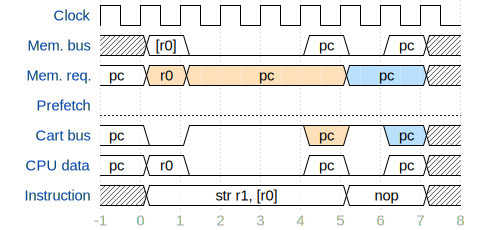
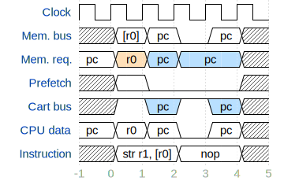

# GBAのサイクルカウントとプリフェッチについて

<pre>
Note: 

この記事は<a href="https://mgba.io/2015/06/27/cycle-counting-prefetch/">Cycle Counting, Memory Stalls, Prefetch and Other Pitfalls</a>を翻訳したもので、主にGBAエミュレータ開発者向けです。
</pre>

ビデオゲームのエミュレータを作るとき、最初の最も基本的なステップは、CPUを実装することです。

一見すると、これは主に命令セットを実装することのように思えます。命令セットは、システムが何をするかを基本的なレベルで指定するものだからです。

しかし、それと同じくらい重要なのが、CPUのもう一つの特徴である「サイクル」です。

## サイクル、パイプライン、ストールについて

命令実行の根底にはクロックと呼ばれるものがあり、これがプロセッサの処理のタイミングを制御しています。

プロセッサのHz数は、クロックが1秒間に何回振動するかを表しており、1回の振動が1クロックサイクルとなります。つまり5GHzのCPUなら1秒間=5Gクロックサイクルとなっています。

クロックはシステムのあらゆる面で非常に重要な役割を果たしていますが、その仕組みは必ずしも明らかではありません。

最近のコンピュータでは、サイクルはシステムの一般的な"速さ"として抽象化されており、エミュレータによってはサイクルカウントはそれほど重要ではない場合が多いです。

しかし、OSが存在しないベアメタルで動いているような古いゲーム機では、サイクルカウントがとても重要になってきます。

OSは、ゲームをユーザースペースに閉じ込めることでハードウェアを抽象化する傾向があり、それはいつでもカーネルによって先取りされる可能性がありますが、ベアメタルコードを先取りできる唯一のものは割り込みです。

システムが複雑になると、OSのような要素がエントロピーをもたらし、実行がますます非決定的になるため、サイクル数を厳密に管理することの重要性は低くなります。このような場合は、サイクルを(程度はあれど)無視した高レベルのエミュレーションによって、ゲームの一部ではなく、システム自体の一部であるルーチンを最適化することができます。

しかし、古いシステムでは、すべてのものがほぼ適切なタイミングでエミュレートしなければゲームが破綻してしまいます。なので、タイミングを把握するためにエミュレータはサイクルをカウントをする必要があります。

単純なシステムなら、各命令は正確に1サイクルで実行されます。

命令の実行では、実行する命令をプログラムメモリ(ROM)から取得し、プロセッサのどの機能を使用すべきかを知るためにハードウェアで命令をデコードし、最後に命令自体を実行します。つまり、命令の実行は、フェッチ、デコード、実行の3段階に分類できます。

このプロセスの各段階は、パイプラインと密接に結びついてます。単純なシステムでは、これらの段階はエミュレーションモデルの中で統合されることが多いです。

しかし、システムが複雑になると、命令によっては1サイクル以上かかるものもあります。

例えば、メモリから値をロードする際に、物理メモリをロードしようとして時間がかかったり、プログラムの別の領域にジャンプする際に、パイプラインがフラッシュされて新しい命令がロードされるまで時間がかかったりします。

これを"パイプラインのストール"または"バブル"と呼びます。パイプラインにストールが発生すると、プロセッサ全体で1サイクル以上の無駄が発生し、実行速度が一時的に低下してしまいます。

最近のプロセッサでは、このようなストールに対応するため、パイプラインをより複雑にしてストールの影響を最小限に抑えています。しかし、古典的なゲーム機には、複雑なパイプラインのようなものはありません。

## サイクル精度

プロセッサの実行で何サイクルが経過したかをカウント(サイクルカウント)することは、それほど重要ではないと思われるかもしれません。

しかしゲームにはGPUやAPUなどCPU以外にも多くの構成要素があり、サイクルをカウントすることで、CPUと適切に同期する必要があります。

そうしないと、フレームの概念がCPUから切り離されてしまい、様々な問題が発生します。エミュレータのタイミングを正しく取るためには、サイクルカウントが絶対に重要です。

システムやゲームのプログラムによっては、CPUと他のサブシステムとの間で適切なタイミングを取ることが強く求められる場合があります。

ここで登場するのが、ゲームのエミュレーションでよく使われる`サイクル精度(cycle accuracy)`という概念です。

サイクル精度は、ゲームのエミュレーションでよく使われる言葉で、厳密に言えば、**ハードウェア上の同一サイクル内で発生するすべてのことが、エミュレータ上で適切にカウントされ、タイミングが取られる**ことを意味します。

この実装には莫大なコストがかかりますし、一見すると不必要と思われるレベルの正確さが求められますが、システムの完璧なエミュレーションのためには、それが必要な場合もあります。

## GBAのサイクル

ゲームボーイアドバンスに搭載されている**ARM7TDMI**は、1998年に開発された比較的古いCPUで、ARMv4Tアーキテクチャを採用しています。

ARMv4は、携帯電話やタブレットなどの最新のデバイスで動作している、よりモダンなARMv7AやARMv8（AArch64）と比べると、シンプルなアーキテクチャです。

以前の記事で紹介したように、ARM7TDMIは3ステージのパイプラインを持っています。上の記事の例のように、フェッチ、デコード、実行の3ステップです。

しかし、フェッチ、デコード、実行の3ステップがすべてが一度に行われるわけではありません。一つの命令が実行されている間に、次の命令がデコードされ、その次の命令がフェッチされます。

また、ARM7TDMIには4種類のサイクルがあり、このサイクルではCPUクロックが異なる時間だけ停止することがあります。

Sサイクルは、最も一般的なサイクルのタイプで、シーケンシャルなメモリアクセスのことです。あるアドレスにアクセスした後、その次のアドレスにアクセスすると、2回目のアクセスはシーケンシャルなアクセスとなり、メモリバスはより速くフェッチすることができます。

次にNサイクルですが、これはノンシーケンシャルなメモリアクセスを指します。Nサイクルは、前の命令とは関係のないメモリアドレスがフェッチされたときに発生します。

3つ目はIサイクルで、これは内部サイクルです。これは、CPUが乗算などの複雑な演算を行う際に、1サイクルでは完了しない場合に発生するものです。

最後にCサイクル（コプロセッサ・サイクル）で、システム内のコプロセッサと通信する際に発生します。しかし、GBAにはARM仕様のコプロセッサがなく、コプロセッサと通信しようとする命令はすべてエラー状態になります。そのため、GBAにとって重要なサイクルは、S、N、Iのみとなります。

Iサイクルでは、常に1クロックサイクルしかかかりません。しかし、SサイクルやNサイクルでは、メモリアクセスができるようになるのを待っている間にCPUのパイプラインが停止することがあります。

バスが空いていて、メモリアクセスが即座にできれば、SサイクルやNサイクルは1クロックサイクルで済みます。しかし、GBAでは多くの種類のメモリアクセスがバスを占有するため、CPUはかなりの頻度でストールしてしまいます。

各ストールの時間は、メモリのどの領域にアクセスするかによって異なります。GBAではこれらのストールを`waitstates`(待機状態)と呼んでいます。

GBAには、9つの異なるメモリ領域があります。(メモリ領域Xは、アドレス`0X000000h`から始まるメモリ領域に存在することを示しています。)

**BIOS**

BIOS（メモリ領域0）には、**基本的な割り込み処理コードと、ゲームデータの解凍やフレームの終了を待つなどの一般的な操作を行うためのユーティリティ関数**が含まれています。

この領域にはwaitstatesがありませんが、領域内のコードを実行しているとき、つまりPCがBIOS内にあるときしか読み出すことができません。

**EWRAM**

256kiBのEWRAM（メモリ領域2）は、**頻繁に扱う必要のないメモリを格納する**ために使用されます。

このメモリへのアクセスには16ビットのバスがあり、32bitの値をここからロードするには、上位16ビットの値をロードするための最初のNまたはSサイクルの上に、さらにSサイクルが必要となります。

EWRAMはNかSかにかかわらず2つのwaitstatesを持っているので、最初のアクセスは2回目と同様に常に3サイクルとなり、32bit値のロードには常に6サイクルかかります。

EWRAMを「オーバークロック」する(つまりwaitstatesの時間を減らす?)ことは可能ですが、これを行っているゲームはありませんし、システムをクラッシュさせる可能性もあります。

**IWRAM**

IWRAM（メモリ領域3）は、32kBのメモリ領域で、ARM7TDMI本体と同じチップに搭載されており、waitstatesは一切ありません。

実行スタックや割込みハンドラなどのよく利用されるデータを格納するのに便利です。

**IO**

メモリマップドI/Oレジスタ（メモリ領域4）には、システム自体の設定に使用される16ビットのレジスタが含まれます。

waitstatesはありませんが、システムの設定にのみ使用され、何かを保存したりコードを実行したりすることはできません。

**Palette**

パレットメモリ（メモリ領域5）には、画面上のグラフィックに使用されるカラーテーブルが格納されています。ここにもwaitstatesはありません。

**VRAM**

VRAM（メモリ領域6）には、画面に描画されるすべてのグラフィックデータが格納されています。主に16ビットの読み書きでアクセス可能で、8ビットの読み書きでは予期せぬことが起こります。

VRAMには、グラフィックスサブシステムがVRAMを使おうとしていない限り、waitstatesはありません。

グラフィックスサブシステムがVRAMを使おうとしている場合は、プロセッサは1サイクルの間、ストールします。

これだけでも、タイミングを管理するのは容易ではない複雑さがあることに注意してください。

このメモリは、コードをIWRAMに置けない場合は、コードを非常に高速に実行したい場合に使うことも可能です。

**OAM**

Object Attribute Memory（メモリ領域7）には、スプライト（GBAではOBJと呼ばれる）の設定値が格納されています。

グラフィックスシステムがその時点でOAMにアクセスしようとしていない限り、ここでのwaitstatesはゼロです。

グラフィックスシステムがOAMにアクセスしようとしているときに、OAMにプロセッサがアクセスした場合はプロセッサは1サイクルの間ストールします。

**Game Pak**

Game Pak ROM（メモリ領域8-13）はカートリッジROMのことで、最大32MiBの読み取り専用のメモリが搭載されています。

カートリッジバスも16ビットですが、このバスではNサイクルとSサイクルのwaitstatesが異なり、設定によって変更が可能です。

Nサイクルでは、これらの領域に2、3、4、8のいずれかのwaitstatesを設定することができます。

Sサイクルは、どのアドレスを使用するかによって異なります。メモリ領域`0x8000..9fff`には1または2のwaitstates、`0xa000..bfff`には1または4のwaitstates、`0xc000..dfff`には1または8のwaitstatesが指定できます。しかし、`0xa000..dfff`はほとんど使われていないので、重要なのは`0x8000..9fff`のwaitstatesです。

**SRAM**

SRAM（メモリ領域14）は、カートリッジ上の書き換え可能なメモリを含んでいます。このバスは8ビット幅しかなく、waitstatesは2、3、4、8サイクルのいずれかに設定可能です。

このバスには特別なSサイクルはなく、ノンシーケンシャルなアクセスと同じwaitstatesになります。

## Game Pak prefetch

ROMへのアクセスは低速で、非常に時間がかかります。

そこで任天堂は、カートリッジバスがアイドル状態のときに、次の命令を自動的にカートリッジから取り出し、次の命令をロードするためにプロセッサがストールする待ち時間を減らす機能を追加しました。

このプリフェッチユニットは、メモリバスとカートリッジバスの間にあり、メモリバスとは独立して動作するため、メモリバスが他のメモリにアクセスしている間でも、カートリッジバスからロードすることができます。

しかし、すべての命令でこれを有効にすると、ほとんどの時間でカートリッジバスがアクティブになってしまいます。

そのため、プリフェッチユニットを起動できるのは、一部の命令に限られています。

前述したように、GBAに関係するサイクルにはS、N、Iの3種類があり、このうち2種類のサイクル(S, N)は、バスがアクセスしようとするメモリの領域に影響されます。

メモリの領域には、WRAMやROMのように遅いものがあります。一方で、IWRAMやVRAMのように高速なものもあります。

しかし、メモリが高速であるかどうかにかかわらず、コードがメモリの領域で実行されている場合、連続してメモリにアクセスすることになります。よってSサイクルはこれに適しています。ただし、ジャンプ命令などで、PCを別の場所に移動させなければならない場合はNサイクルとなります。

すべての種類のサイクルは、1サイクルを基本に、メモリの領域を読み出すために必要なwaitstatesの数を加えます。

プリフェッチとは、ROMからメモリを実行しているときに、メモリカーソルがROMを指していない、つまりカートリッジバスが空いているなら、カーソルが戻されるまでROMから先読みをしてくれるというものです。

メモリカーソルがROMに戻っても、すでに命令は読み込まれているので、NサイクルとSサイクルの両方のwaitstatesが消え、メモリカーソルの移動による実行時間のロスを回避できます。

ここでは、タイミングが非常に重要になってきます。

プリフェッチは、ROMへのアクセスに使用されていないIサイクル、Nサイクル、Sサイクルの間にのみ動作します。

したがって、システムの他の場所からメモリを読み込んでいる場合は、そのメモリの読み込みに使用されるサイクルごとに1つのwaitstatesが消滅します。

ROMのロードのための1セットのwaitstatesが経過すると、そのアドレスからの16ビットの値がプリフェッチバッファに格納されます。

このように、Iサイクルや、ROMに触れないNサイクルやSサイクルでは、プリフェッチによって近くのROM値をロードする時間を節約することができます。

次の図は、`str r1, [r0]; nop;`という、レジスタ`r0`の指すメモリアドレスをロードし、ロードした値を`r1`にストアした後、1命令分の動作を行わないという処理のシーケンスを表した図で、プリフェッチなしの場合を表しています。

この図では、`r0`はROM内のアドレスではなく、waitstatesが0のメモリ領域のアドレスであると仮定します。

また、ROM内のNサイクルはwaitstatesが3、Sサイクルはwaitstatesが1で遅延するものとします。

<pre>
Note:

最初の行はクロックを表しています。線がhighになるところはサイクルの始まりを、線がlowになるところは、クロックサイクルの終わりを表しています。

2行目と3行目はメモリバスで、2行目は現在バスに乗っている値を示し、3行目は要求されているメモリを示しています。

4行目は、この図ではプリフェッチユニットが無効になっていることを示しています。

次の行は、Wカートリッジバスの現在の動作を示しています。これがlowのときは、バスがアイドル状態であることを示しています。highになると、バスがデータの戻りを待っていることを意味し、バス上でデータが利用可能になるとデータが表示されます。

6行目は、CPUが現在どのデータを処理しているかを示しています。これがlowのときは、CPUがストールしていることを意味しています。

最後の行は、現在どの命令が実行されているかを示しています。

Sサイクルは青、Nサイクルはオレンジで表現されています。
</pre>

上の図を見ると、`str`（メモリ格納命令）が始まる前(`t=-1`)に、pcにあるメモリがCPUにロードされます。

`t=0`で`str`が開始され、`r0`のメモリを要求します。上で仮定したように、このメモリは高速なので、waitstatesはゼロで、1サイクルで動作が完了します。しかし、メモリカーソルは移動するため、Nサイクルになっています(`t=0`の`Mem. req.`がオレンジになっている)

次(`t=1`)に、パイプラインの終端の命令をロードしようとします。メモリカーソルを`pc`へと戻したので、これもNサイクルとなり、メモリがバスに到達するまでに3サイクルのwaitstatesがかかります。

最後のサイクル(`t=4`)では、メモリをCPUにロードし、次の命令を開始することができます。

`t=5`のNOPは何もせず、次の命令をロードします。これはSサイクルなので、命令がロードされるまで1サイクルのwaitstatesを経て、その後、続行することができます。(`t=5..6`の`Mem. req.`が青になっている)

よって、これらの2つの命令は、合計で7サイクルで終了します。

次の図は、同じ処理(`str r1, [r0]; nop;`)でプリフェッチを有効にした場合の様子です。他には何も変わっていません。

`t=0`では、`r0`をロードするときのNサイクルが残っていますが、ROMへのアクセスを必要としないNサイクルなので、`t=0`ではプリフェッチユニットが実行できます。

そのおかげで`t=1`ではSサイクルでROMからのロードを行うことができます。これはSサイクルなので、1サイクルのwaitstatesだけで、次のサイクルでロードが終了します。

このように、CPUから見たロードは1サイクルで済み、waitstatesも消えています。これにより3サイクルが節約され、この2つの命令の時間は4サイクルに短縮されました。

もし、`str`がもう1サイクルかかっていたら、`t=2..3`の間はカートリッジバスが空いているため、プリフェッチユニットが機能できるので、次の命令を待つ`nop`のwaitstatesも消えて、`nop`は1サイクルになっていたでしょう。
