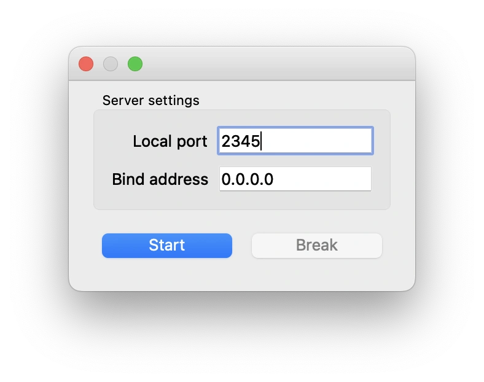

# mGBAを GDB+Ghidra でデバッグする方法

## 動作環境

```
System: M1 Mac
mGBA: v0.9.3
Ghidra: v10.1 (with Java v11.0.2)
GDB: arm-none-eabi-gdb v9.2
```

## 手順

1. mGBAを開いて`0.0.0.0:2345`(任意)でGDBリモートサーバーを立てる



2. Ghidraで対象のプロジェクトを`Open with > Debugger`で開く
3. `Debugger Targets`で次のようにする


4. シェルでGDB(`Debugger Targets`で指定したのと同じパス)を開いて、`new-ui mi2 xxxx`を入力する これでGDBをGhidraから操れるようになる


5. Ghidra上のGDBインタプリタで次のバッチファイルを実行して、GDB+GhidraをmGBAに接続させる

```txt
define info proc mappings
echo 0x0 0xFFFFFFFF 0x100000000 0x0 mem \n
end
target remote :2345
```

```gdb
source FILEPATH.txt
```
