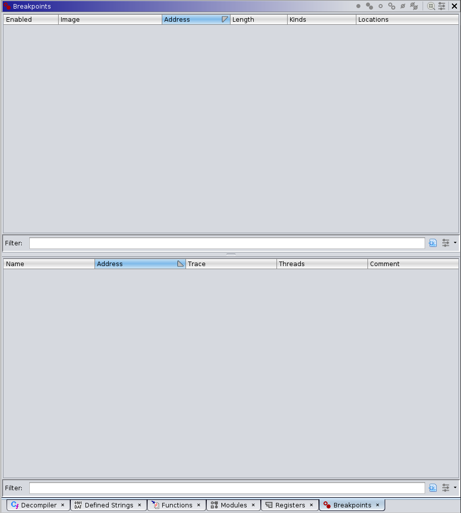
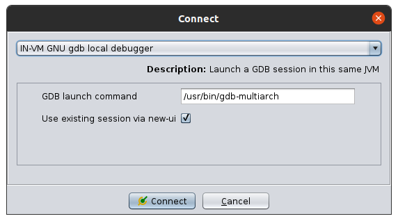

# A first look at Ghidra’s Debugger - Game Boy Advance Edition

<pre>
Note: 

この記事は<a href="https://wrongbaud.github.io/posts/ghidra-debugger/">A first look at Ghidra’s Debugger - Game Boy Advance Edition
</a>を翻訳したものです。
</pre>

## 概要

昨日、NSAのTwitterアカウントは、待望のデバッグ機能を備えたGhidraの新しいブランチがリリースされたことを発表しました。

これにより、GDBスタブやその他の様々なデバッグメカニズムを使って、Ghidra内のプログラムをシングルステップでデバッグできるようになります。これを記念して、このバージョンのGhidraをビルドする方法をレビューし、楽しいターゲットでこのデバッガを使用する方法の例を示したいと思います。

この記事では、以下のことを説明します。

- Dockerコンテナを使ってGhidraの最新版（または任意のバージョン）をビルドする方法
- Ghidra Eclipseプラグインの作り方
- Ghidra用プログラムローダーの作り方
- GDBスタブを用いたGhidraによるプログラムのデバッグ
- デバッグ機能を使って、GBAのゲームでパスワードがどのように処理されているのかを知ることができる

今回の記事では、ゲームボーイアドバンス用ゲーム「スパイダーマン：ミステリオの脅威」を取り上げます。このテーマに関して、stacksmashingやLiveoverflowが行っている素晴らしい仕事に大いに刺激を受けました。

これは私が多くの時間を費やしてプレイしたゲームであり、リバースエンジニアリングの観点から子供の頃のお気に入りを振り返ることは常に楽しいことです。

最終的な目標は、カスタムローダーを使ってこのROMを正しくロードし、Ghidraのデバッグ機能を使ってエミュレータのGDBスタブに接続する方法を示すことです。

## Ghidraのビルド

まず最初に、このデバッガブランチはまだ公式リリースに含まれていないので、自分でビルドする必要があります。幸運なことに、dukebarman がこれを行うための Dockerコンテナを用意してくれています。必要なのは、デバッガブランチをチェックアウトするようにスクリプト`build_ghidra.sh`を修正することだけです。

```sh
git clone https://github.com/NationalSecurityAgency/ghidra -b debugger
```

また、このバージョンの Ghidra用の Eclipse開発拡張を構築します。これは、後にローダーを構築したり、解析スクリプトを書いたりするときに役立ちます。これを行うために、スクリプト`build_ghidra.sh`に以下の行を追加します。

```sh
gradle prepDev
gradle eclipse -PeclipsePDE
```

次に、READMEの指示に従います。

```sh
cd ghidra-builder
sudo docker-tpl/build
cd workdir
sudo ../docker-tpl/run ./build_ghidra.sh
```

出来上がったビルドは`workdir/out`にあります。

```sh
wrongbaud@wubuntu:~/blog/gba-re-gbd/ghidra-builder/workdir$ ls out/
ghidra_9.3_DEV_20201218_linux64.zip
```

このファイルを解凍すると、スクリプト`./ghidraRun`でGhidraを起動できるようになります。

今回の記事では、このファイルをディレクトリ`ghidra-builder/workdir`に解凍します。これは、このバージョンのGhidra用のGhidraローダーを構築するために、Dockerコンテナを使用するためです。この記事に沿って作業を進めている方は、`workdir`ディレクトリが以下のようになっているはずです。

```sh
wrongbaud@wubuntu:~/blog/gba-re-gbd/ghidra-builder/workdir$ ls
build_ghidra.sh  ghidra  ghidra_9.3_DEV out  set_exec_flag.sh
```

## Building the ROM Loader

TODO

## ROMの解析

前述したように、ここでの目的は、このゲームで使われているパスワードシステムを理解することです。パスワードを入力しようとすると、次のような画面が表示されます。


子音ばかりで母音がなく、数字の0~9があり、パスワードは5文字しかないことに注意してください。これはリバースエンジニアリングとしての良い出発点になります。この情報をもとに、興味のある機能を絞り込んでいくことができます。

この値がどこかの文字列で表現されているかどうか、ROMの文字列を`Defined Strings`で見てみましょう。

パスワード文字として利用可能な最初の5つの文字については、次のようになります。


ここまでは良いのですが、この文字列は2つのインスタンスしか使用されていません。1つは`0x804c11fc`に、もう1つは`0x84b86f0`にあります。1つ目の文字列を調べてみると、この文字列は`0x8003358`にある次の関数に渡されていることがわかります。

```cpp
undefined4 passwd_1(int param_1,int param_2) {
  int iVar1;
  uint uVar2;
  uint uVar3;
  undefined4 in_lr;
  undefined auStack52 [36];
  undefined4 uStack4;
  
  uStack4 = in_lr;
  FUN_080231f4(auStack52,"BCDFGHJKLMNPQRSTVWXYZ0123456789-",0x21);
  *(uint *)(param_1 + 0x8c) = 0;
  FUN_080025f8(param_1);
  FUN_08002674(param_1);
  FUN_08002714(param_1);
  FUN_0800282c(param_1);
  iVar1 = 0;
  uVar3 = *(uint *)(param_1 + 0x8c);
  uVar2 = 0;
  do {
    *(undefined *)(param_2 + iVar1) = auStack52[uVar3 >> (uVar2 & 0xff) & 0x1f];
    uVar2 = uVar2 + 5;
    iVar1 = iVar1 + 1;
  } while (iVar1 < 5);
  return uStack4;
}
```

変数`iVar1`が5未満の間ループしているwhileループにも注目してください。

これは、パスワードの長さが5であることがわかっているので、この関数が有用であることを示しています。`passwd_1`という名前をつけて、文字列の他の使い方に進みましょう。次に見ることができるのは、`0x8002CEC`の関数で、その分解結果を以下に示します。

```cpp
undefined8 passwd_2(void) {
  int iVar1;
  int iVar2;
  uint uVar3;
  undefined4 in_lr;
  undefined local_98 [5];
  undefined local_93;
  undefined auStack144 [36];
  undefined auStack108 [8];
  undefined auStack100 [72];
  undefined4 uStack4;
  
  uStack4 = in_lr;
  FUN_08000b0c(0,1,0,0);
  DAT_03001fd0._0_2_ = 0x1444;
  DISPCNT = 0x1444;
  FUN_0801e330(&DAT_0838277c);
  iVar1 = DAT_03001fe0;
  FUN_080231f4(auStack144,"BCDFGHJKLMNPQRSTVWXYZ0123456789-",0x21);
  *(uint *)(iVar1 + 0x8c) = 0;
  FUN_080025f8(iVar1);
  FUN_08002674(iVar1);
  FUN_08002714(iVar1);
  FUN_0800282c(iVar1);
  iVar2 = 0;
  uVar3 = 0;
  do {
    local_98[iVar2] = auStack144[*(uint *)(iVar1 + 0x8c) >> (uVar3 & 0xff) & 0x1f];
    uVar3 = uVar3 + 5;
    iVar2 = iVar2 + 1;
  } while (iVar2 < 5);
  local_93 = 0;
  FUN_0801d1bc(auStack108,local_98);
  FUN_0801d92c(DAT_03001ff0,0x10,0);
  FUN_08000b0c(1,1,0,0);
  *(undefined4 *)(DAT_03002028 + 0xc) = 0x200;
  FUN_08000f1c();
  iVar1 = FUN_0801d26c(auStack108);
  *(undefined4 *)(DAT_03002028 + 0xc) = 0;
  FUN_08000f1c();
  FUN_0801dcac(DAT_03001ff0,0);
  FUN_08000b0c(0,1,0,0);
  FUN_08004408(auStack100,2);
  return CONCAT44(uStack4,(uint)(iVar1 == 0));
}
```

今回も文字列が関数に渡されています。また、5回繰り返して実行されるwhileループも見られます。これを`passwd_2`とし、次の使い方に進みましょう。

`0x84b86f0`にある文字列は、`FUN_0801c37c`にある最初の関数を調べるために、2つの関数でも使用されています。

```cpp
undefined4 render_pw_screen(int param_1) {
  int iVar1;
  int iVar2;
  uint uVar3;
  undefined4 uVar4;
  uint uVar5;
  undefined4 in_lr;
  char local_1c [8];
  undefined4 uStack4;
  
  uStack4 = in_lr;
  iVar2 = FUN_0801b834(DAT_03001ffc,"@ - Accept   & - Backspace");
  iVar1 = DAT_03001ffc;
  *(uint *)(DAT_03001ffc + 0x90) = 0xf0U - iVar2 >> 1;
  *(undefined4 *)(iVar1 + 0x94) = 0x96;
  FUN_0801b764(iVar1,"@ - Accept   & - Backspace");
  uVar3 = *(uint *)(param_1 + 0x51c);
  if (uVar3 != 0) {
    uVar5 = 0;
    if (uVar3 != 0) {
      do {
        local_1c[uVar5] = "BCDFGHJKLMNPQRSTVWXYZ0123456789-"[*(byte *)(param_1 + 0x520 + uVar5)];
        uVar5 = uVar5 + 1;
      } while (uVar5 < uVar3);
    }
    local_1c[*(int *)(param_1 + 0x51c)] = '\0';
    iVar2 = FUN_0801b834(DAT_03002000,local_1c);
    iVar1 = DAT_03002000;
    *(uint *)(DAT_03002000 + 0x90) = 0xf0U - iVar2 >> 1;
    *(undefined4 *)(iVar1 + 0x94) = 0x3f;
    iVar2 = FUN_0800118c(DAT_03001fdc,5);
    *(byte *)(iVar1 + 5) = *(byte *)(iVar1 + 5) & 0xf | (byte)(iVar2 << 4);
    FUN_0801b764(DAT_03002000,local_1c);
  }
  if (*(int *)(param_1 + 0x51c) != 5) {
    uVar4 = FUN_0801a6d4(*(undefined4 *)(param_1 + 0x18));
    *(undefined4 *)(param_1 + 4) = uVar4;
  }
  return uStack4;
}
```

この関数を見てみると、`FUN_0801b764`が `@ - Accept`と`& - Backspace` で呼び出されていることがわかります。

その後、目的の文字列を含む変数で同じ関数が呼び出されていることがわかります。

さらに`FUN_0801b764`を調べてみると、第2の変数（ASCII文字列）のデータを第1引数のメモリアドレスにコピーしています。

この時点では何とも言えませんが、この関数は画面上にテキストを表示するためのものではないかと思われますので、今のところは無視して、次のパスワード文字列の使い方に移ります。

```cpp
undefined8 FUN_0801c454(int param_1) {
  int iVar1;
  int iVar2;
  undefined4 in_lr;
  char local_14 [8];
  undefined4 uStack4;
  
  iVar2 = 1;
  uStack4 = in_lr;
  FUN_080231f4(local_14,"CRDT5",6);
  iVar1 = 0;
  do {
    if (local_14[iVar1] != "BCDFGHJKLMNPQRSTVWXYZ0123456789-"[*(byte *)(param_1 + 0x520 + iVar1)]) {
      iVar2 = 0;
    }
    iVar1 = iVar1 + 1;
  } while ((iVar1 < 5) && (iVar2 != 0));
  return CONCAT44(uStack4,iVar2);
}
```

では、ここで何が起こっているのでしょうか？まず、`FUN_080231f4`ですが、これは基本的に`memcpy`の操作です。

```cpp
undefined4 * memcpy_1(undefined4 *dest,undefined4 *src,uint count) {
  undefined4 uVar1;
  undefined4 *puVar2;
  undefined4 *puVar3;
  
  puVar2 = dest;
  if ((0xf < count) && ((((uint)src | (uint)dest) & 3) == 0)) {
    do {
      *puVar2 = *src;
      puVar2[1] = src[1];
      puVar3 = src + 3;
      puVar2[2] = src[2];
      src = src + 4;
      puVar2[3] = *puVar3;
      puVar2 = puVar2 + 4;
      count = count - 0x10;
    } while (0xf < count);
    while (3 < count) {
      uVar1 = *src;
      src = src + 1;
      *puVar2 = uVar1;
      puVar2 = puVar2 + 1;
      count = count - 4;
    }
  }
  while (count = count - 1, count != 0xffffffff) {
    *(undefined *)puVar2 = *(undefined *)src;
    src = (undefined4 *)((int)src + 1);
    puVar2 = (undefined4 *)((int)puVar2 + 1);
  }
  return dest;
}
```

つまり、文字列`CRDT5`を`local_14`で指定されたメモリ位置のポインタにコピーしているのです。次にwhileループの中で、この値が比較に使われていることがわかります。

```cpp
if (local_14[iVar1] != "BCDFGHJKLMNPQRSTVWXYZ0123456789-"[*(byte *)(param_1 + 0x520 + iVar1)])
```

では、ここで何が起こっているのでしょうか。ループごとに、`local_14`の文字が、`BCDFGHJKLMNPQRSTVWXYZ0123456789-`の文字列の中の利用可能な文字の値と比較されます。

この動作は、パスワードチェック関数に期待されるものと一致しているように見えます。

しかし、`iVar1`は繰り返しごとに1ずつ増加することがわかっていますが、これはパスワードが`BCDFGHJKLMNPQRSTVWXYZ0123456789-`の連続した文字で構成されていなければならないことを意味しているのでしょうか？それは非常に愚かなことだと思います。

また、`CRDT5`という文字列がこの比較チェックを通過することもあり得ません。この比較をもう一度見てみると、変数`param_1`がインデックスとして使われていて、`iVar1`と`0x520`が追加されています。

では、具体的にどのような意味があるのでしょうか。

`param_1` は、パスワード画面で入力された文字を表すオフセットの配列を指していると思われます。例えば、パスワード `GHDRR` を入力すると、配列には `[0x4,0x5,0x2,0xd,0xd]` が含まれます。

しかし、先走ることなく、パスワード`CRDT5`を入力してみて、どうなるか見てみましょう。


クレジットの画面が出てきました！

簡単なことだと思いませんか？しかし、パスワードがメモリ上のどこに保存されているかをもう少し詳しく知ることができたらどうでしょうか。`param_1`がどこを指しているかがわかれば、パスワードがRAM上のどこにあるかを計算し、相互参照を探すことができます。さて、気になる関数ができたところで、デバッガを起動してみましょう。

## ROMのデバッグ

Ghidraのプロジェクトマネージャの虫のアイコンを見てください。


これは、デバッガを開くために使用します。虫アイコンをクリックすると、以下のようなウィンドウが表示されます。


通常の解析画面に比べて、多くのタブやウィンドウが追加されていることに気づくでしょう。

まず左上には、`Debugger Targets`画面があります。これは、デバッガへの接続を確立したり、新しいデバッグセッションを開始したりするときに使用します。


そのすぐ下には`Objects`ウィンドウがあり、デバッグ中の`Objects`が表示されます。ここでは、一時停止やシングルステップなどの操作が可能です。


その下、画面の下の方には、メモリ領域画面、スタック画面、そして標準的なコンソールがあります。


その隣には、スレッド用の画面とTimeウィンドウがあります。今回の作業（シングルスレッドのARMシステムのデバッグ）では、これらの表示画面は使用しません。


最後に、右側にはGhidra analyzerのセッションで通常見られるものよりもいくつかのタブがあります。



また、ブレークポイントに到達するとレジスタの値が更新される`Registers`ビューも用意されています。

最後に、必要に応じてロードされた様々なモジュールが表示されるモジュールビューがありますが、このシンプルなアプリケーションでは何も表示されません。


## エミュレータのアタッチ

今回の作業では、主にリモートGDBスタブを提示する機能があるため、mGBAエミュレータを使用しています。これに`gdb-multiarch`で接続することになります。

Ghidraのデバッガ画面からこれを行うには、次のようにします。デバッガのターゲットウィンドウで、緑色のプラグ（Connect）をクリックすると、次のウィンドウが開きます。



リモートデバッグには複数の選択肢があります。この記事では、`IN-VM GNU gdb local debugger`を使用します。

gdb起動のコマンドパスに`gdb-multiarch`を追加しました。接続をクリックすると、標準的なGDBプロンプトが表示されます。


次にサーバーを起動します。mGBA内でROMをロードし、`Tools -> Start GDB Server`を選択すると、次のようなプロンプトが表示されます。


`Start`をクリックし、Ghidraデバッガのウィンドウに戻ります。gdbプロンプト内で、以下のコマンドを実行します。

```sh
set architecture arm
set arm fallback-mode thumb
set arm force-mode thumb
target remote localhost:2345
break *0x801c470
c
```

これは、gdbが使用する適切なアーキテクチャを設定し、リモートサーバに接続し、最後にクレジット画面を表示するかをチェックするために使用されると思われる関数にブレークポイントを設定します。具体的には、私たちが提供した文字と、利用可能な文字列から抽出した文字を比較する部分です。ここでは、このアセンブリ・スニペットに注目します。

```asm
                             LAB_0801c470                                    XREF[1]:     0801c48c(j)  
        0801c470 69 46           mov        r1,sp
        0801c472 88 18           add        r0,r1,r2 
        0801c474 a1 18           add        r1,r4,r2 ; Update the pointer to the password we entered with the current index
        0801c476 09 78           ldrb       r1,[r1,#0x0]; r1 contains the provided password index value, for example "B" == 0, "C"==1, etc
        0801c478 c9 18           add        r1,r1,r3; r3 contains the pointer to the string of available characters, we are adding the index of the current password character to this pointer.
        0801c47a 00 78           ldrb       r0=>local_14,[r0,#0x0] ; Load r0 with the value of the "CRDT5" string at the index specified by r2 from the location on the stack
        0801c47c 09 78           ldrb       r1,[r1,#0x0]=>s_BCDFGHJKLMNPQRSTVWXYZ012345678   = "BCDFGHJKLMNPQRSTVWXYZ01234567 ; Load the character representation of the entered value we provided for the password
        0801c47e 88 42           cmp        r0,r1 ; Compare the two!
        0801c480 00 d0           beq        LAB_0801c484
        0801c482 00 25           mov        r5,#0x0
                             LAB_0801c484                                    XREF[1]:     0801c480(j)  
        0801c484 01 32           add        r2,#0x1; Increment the index counter
        0801c486 04 2a           cmp        r2,#0x4
        0801c488 01 dc           bgt        LAB_0801c48e
        0801c48a 00 2d           cmp        r5,#0x0
        0801c48c f0 d1           bne        LAB_0801c470
```

これらのコマンドを入力した後、Ghidraを使ってブレークポイントがヒットするかどうかを見てみましょう。


素晴らしいことに、ブレークポイントがヒットしただけでなく、レジスタウィンドウですべてのレジスタが更新されています。

さて、パスワードチェックについての仮定が正しいかどうか調べてみましょう。`0x0801c474`に到達するまでいくつかの命令を実行してみましょう。

この時点での仮定は、入力された文字を表すインデックスの配列を`r1`が指しているということです。メモリを調べてみましょう。

NOTE: gdb-multiarchを使ってリモートでデバッグしていて、いくつかのブレークポイントがヒットしない場合、`c`の代わりに`stepi`コマンドを使ってみてください。これは以前にmGBAで見た問題であり、GhidraのGDBサーバとは関係ありません。

```sh
(gdb)x/10x $r1
0x2005998:  0x01  0x0d  0x02  0x0f  0x1a  0x00  0x00  0x00
0x20059a0:  0x00  0x4f
```

これはまさに期待通りで、パスワードとして入力した実際のアスキー文字を保存する代わりに、そのインデックス値を利用可能な文字のテーブルに保存します。

インデックス | 文字
-- | -- 
0x01 | `C`
0x0d | `R`
0x02 | `D`
0x0f | `T`
0x1a | `5`

この理論を検証するために、パスワードに`CGHDR`を入力し、同じブレークポイントを設定するとどうなるか見てみましょう。

```sh
Breakpoint 3, 0x0801c476
Can't determine the current process's PID: you must name one.
(gdb)x/10x $r1
0x2005998:  0x01  0x04  0x05  0x02  0x0d  0x00  0x00  0x00
0x20059a0:  0x00  0x60
```

インデックス | 文字
-- | -- 
0x01 | `C`
0x04 | `G`
0x05 | `H`
0x02 | `D`
0x0d | `R`

これで、パスワードがどのように保存されているか、メモリ上でどのようになっているかがわかり、Ghidra内でデバッグやブレークポイントの設定ができるようになりました。次回の記事では、Ghidraと今日設定したリモートGDBデバッグ機能を使って、他のパスワード機能について調べてみたいと思います。
