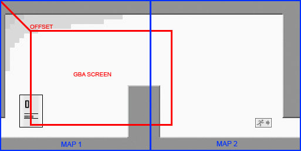

# 背景スクロール

## オフセットレジスタ

### 0x0400_0010 - BG0HOFS - BG0 Xオフセット & 0x0400_0012 - BG0VOFS - BG0 Yオフセット (W)

- BG0HOFS = BG0 の X方向(Horizontal) のオフセット(OFS)
- BG0VOFS = BG0 の Y方向(Vertical) のオフセット(OFS)

 bit  |  内容
---- | ----
0-8 | オフセット(0-511)
9-15 | 未使用

BG0背景レイヤーの左上のピクセルの座標を指定します。

### 0x0400_0014 - BG1HOFS - BG1 Xオフセット & 0x0400_0016 - BG1VOFS - BG1 Yオフセット (W)

BG1背景レイヤーの左上のピクセルの座標を指定します。

### 0x0400_0018 - BG2HOFS - BG2 Xオフセット & 0x0400_001a - BG2VOFS - BG2 Yオフセット (W)

BG2背景レイヤーの左上のピクセルの座標を指定します。

### 0x0400001c - BG3HOFS - BG3 Xオフセット && 0x0400001e - BG3VOFS - BG3 Yオフセット (W)

BG3背景レイヤーの左上のピクセルの座標を指定します。

## 補足

上記のBGオフセットレジスタは、テキストモードでのみ、つまりBGモード0の全レイヤ(BG0-3)とBGモード1の最初の2つのレイヤ(BG0-1)に使用されます。

伸縮回転とビットマップモードでは、上記のレジスタは無視されます。その代わりに、[BG の伸縮回転用のオフセットレジスタ](scalerot.md#オフセットレジスタ)を変更することで、画面をスクロールさせることができます。

