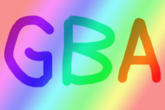

# モザイク

モザイク機能は、使用することを選択したBGやスプライト１個づつに対して、画像を縦×横の一定サイズで区切り、その部分を左上の色で塗りつぶすというものです。

色を混ぜるわけではありません。

モザイク効果(6×6)を適用すると、6×6の範囲はすべて(0,0)の色になるので

 

は

のようになります。

## モザイクの有効化

モザイク機能は[BG制御レジスタ](./control.md)によってBG0-3に対して個別にON/OFFができます。

また[OAMのアトリビュート](./sprite.md#objアトリビュート0-rw)をいじることでOBJ0-127に対しても個別でON/OFFできます。

## 0x0400_004c - MOSAIC - モザイクサイズ (W)

またこのMOSAICレジスタをすべて0に設定することでモザイク機能そのものを無効にすることができます。

 bit  |  内容
---- | ----
0-3   | BGモザイクサイズX - 1
4-7   | BGモザイクサイズY - 1
8-11  | OBJモザイクサイズX - 1
12-15 | OBJモザイクサイズY - 1
16-31 | 不使用

例: 先程の例のように6×6単位でモザイクを当てたい時は、BGモザイクサイズX、BGモザイクサイズYにそれぞれ5をセットすることで実現できます。

通常、モザイクピクセル(上の例なら6×6の左上のピクエル)は左上のピクセルの色となります。

場合によっては、領域の中央にあるピクセルの色を使った方が良いかもしれません。 これは背景をスクロールすることで得られるかもしれません。
