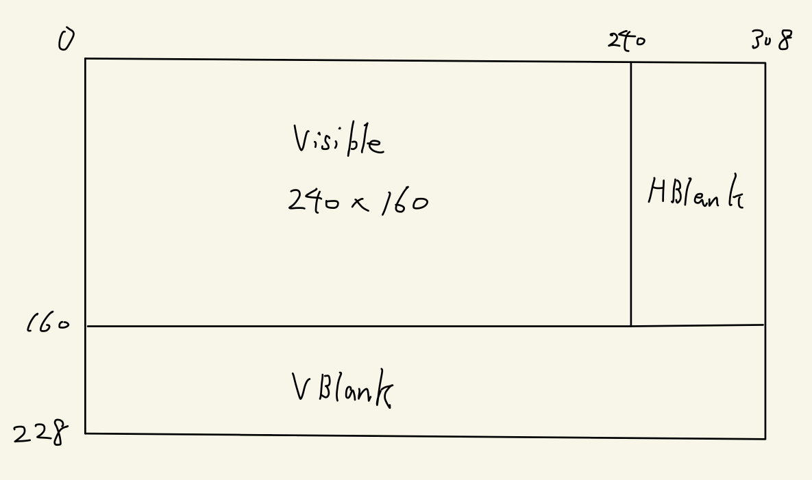

# 描画サイクル

GBAの画面描画は上から順に1行ずつやっていきます。

HBlank、VBlankも含めた画面の概略図は次のようになっています。



## 列の描画

現在描画中の行を左から右に1列(1ピクセル)ずつ描画していきます。

1ピクセル(=dot)描画するのにCPU時間で4サイクルかかります。

```
  Visible     240px, 57.221 us, 960サイクル
  HBlank      68px, 16.212 us, 272サイクル
  Total       308px, 73.433 us, 1232サイクル
```

VRAMとPaletteにはHBlank中のみアクセス可能です。OAMはHBlank中に加えて、DISPCNTのbit5がセットされているときのみアクセス可能です。

## 行の描画

1行を描画し終えたら次の行の描画に写ります。行の描画は上から下へと行われます。

```
  Visible (*) 160行, 11.749 ms, 197120サイクル
  VBlank      68行,  4.994 ms,  83776サイクル
  Total       228行, 16.743 ms, 280896サイクル
```

VBlank中はVRAM,OAM,Palette全てにアクセス可能です。

VBlank中(160\~228行)は、240\~308pxのHBlank期間に入ってもHBlank割り込みは発生しません。

> [!NOTE]
> 縦画面のサイズは160px(160行)ですが、上の8pxは実際には見えません。  
> これらの行は、光源に向けてGBAを持っているときに影に覆われています。これらの行は事実上黒です。そして、重要な情報を表示するために使用するべきではありません。

## システムクロック

CPUのクロックは 16.78MHz(16×1024×1024Hz) なので、1サイクルあたり59.59ns秒です。

## インターフェイス

The LCD display is using some sort of interlace in which even scanlines are dimmed in each second frame, and odd scanlines are dimmed in each other frame (it does always render ALL lines in ALL frames, but half of them are dimmed).

The effect can be seen when displaying some horizontal lines in each second frame, and hiding them in each other frame: the hardware will randomly show the lines in dimmed or non-dimmed form (depending on whether the test was started in an even or odd frame).
Unknown if it's possible to determine the even/off frame state by software (or possibly to reset the hardware to this or that state by software).

Note: The NDS is applying some sort of frameskip to GBA games, about every 3 seconds there will by a missing (or maybe: inserted) frame, ie. a GBA game that is updating the display in sync with GBA interlace will get offsync on NDS consoles.
