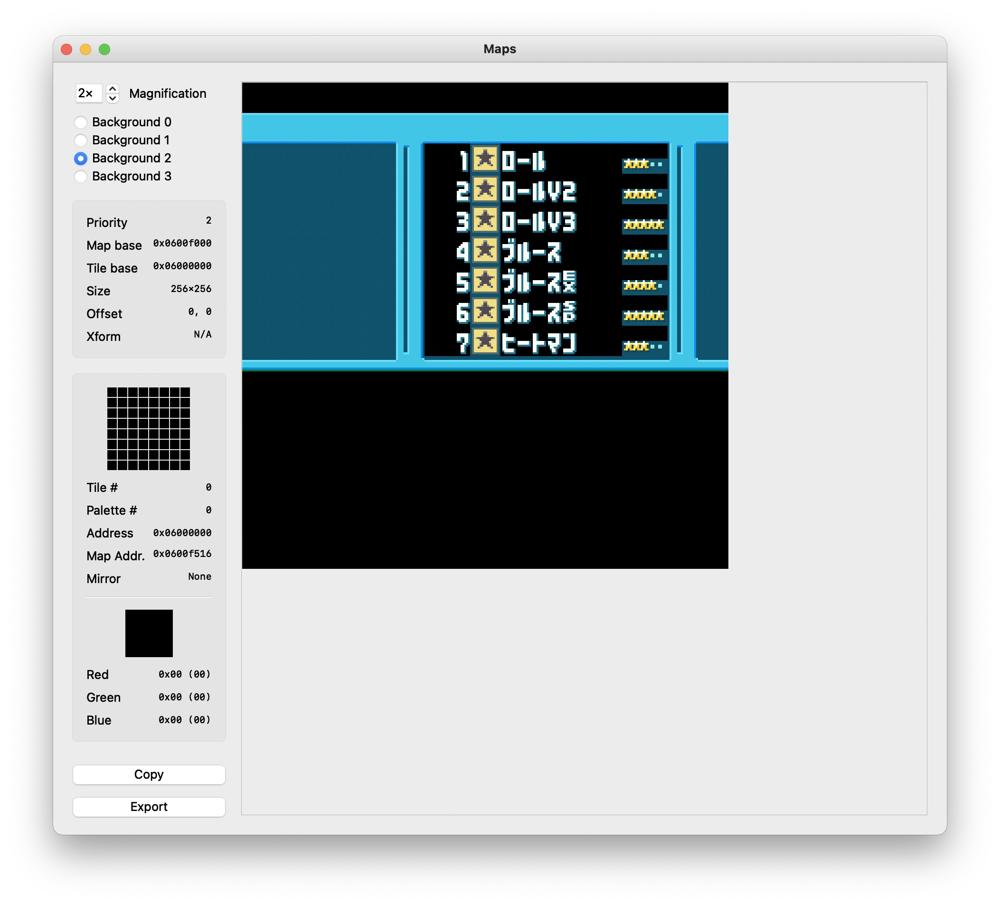

# ウィンドウ

ウィンドウ機能は、画面の一定の領域を指定し、その内部と外部で各BGレイヤやスプライトなどを表示するか表示しないかを指定する機能です。

ウィンドウには、Window0, Window1, OBJWindowの3種類があります。

## 例

ロックマンエグゼ6の次のライブラリの画面ではウィンドウが使われています。


BG2レイヤがウィンドウとして使われています。




## ウィンドウの有効化

[ディスプレイ制御](control.md)で紹介したDISPCNTの13-15bit は Window0, Window1, OBJ Windowを有効化するために使用されます。

DISPCNTのbit8-12は BG0-3,OBJレイヤのマスタイネーブルビットとして使用され、DISPCNTと後述のWININ/WINOUT の 有効ビットの両方がセットされている場合にのみレイヤーが表示されます。

## ウィンドウの座標の設定

### ウィンドウのX座標

```
0x0400_0040 - WIN0H - Window0のX座標 (W)
0x0400_0042 - WIN1H - Window1のX座標 (W)
```

 bit | 内容
---- | ----
0-7  | X2, ウィンドウの右端のX座標+1
8-15 | X1, ウィンドウの左端のX座標

X2が不正な値(X2>240 または X1>X2)のときは X2=240として扱われます。

### ウィンドウのY座標

```
0x0400_0044 - WIN0V - Window0のY座標 (W)
0x0400_0046 - WIN1V - Window1のY座標 (W)
```

 bit | 内容
---- | ----
0-7  | Y2, ウィンドウの下端のY座標+1
8-15 | Y1, ウィンドウの上端のY座標

Y2が不正な値(Y2>160 または Y1>Y2)のときは Y2=160として扱われます。

## ウィンドウの挙動制御

### 0x0400_0048 - WININ - 内側制御レジスタ (R/W)

 bit | 内容
---- | ----
0-3   | Window0 BG0-BG3表示フラグ     (0=非表示, 1=表示)
4     | Window0 OBJ表示フラグ          (0=非表示, 1=表示)
5     | Window0 Color Special Effect    (0=Disable, 1=Enable)
6-7   | 不使用
8-11  | Window1 BG0-BG3表示フラグ     (0=非表示, 1=表示)
12    | Window1 OBJ表示フラグ          (0=非表示, 1=表示)
13    | Window1 Color Special Effect    (0=Disable, 1=Enable)
14-15 | 不使用

### 0x0400_004a - WINOUT - 外側・OBJウィンドウ内側制御レジスタ (R/W)

 bit | 内容
---- | ----
0-3   | Outside BG0-BG3表示フラグ      (0=非表示, 1=表示)
4     | Outside OBJ表示フラグ           (0=非表示, 1=表示)
5     | Outside Color Special Effect     (0=Disable, 1=Enable)
6-7   | 不使用
8-11  | OBJ Window BG0-BG3表示フラグ   (0=非表示, 1=表示)
12    | OBJ Window OBJ表示フラグ        (0=非表示, 1=表示)
13    | OBJ Window Color Special Effect  (0=Disable, 1=Enable)
14-15 | 不使用

## OBJウィンドウ(`OBJWIN`)

OBJウィンドウの寸法は、OBJ Mode属性がOBJウィンドウになっているOBJによって指定されます。そのようなOBJの透明でないドットはOBJウィンドウ領域としてマークされます。OBJ自体は表示されません。

これらのOBJの色、パレット、表示優先度は無視されます。OBJウィンドウ領域を定義する際には、DISPCNTのbit12とbit15の両方を設定する必要があります。

## ウィンドウの優先度

複数のウィンドウが有効になっていて、これらのウィンドウが重なっている場合、優先度は `WIN0 > WIN1 > OBJWIN`の順です。

ウィンドウの優先度が`0`の場合、任意のウィンドウ領域の内側にないすべてのドットにウィンドウの外側エフェクトが使用されます。
